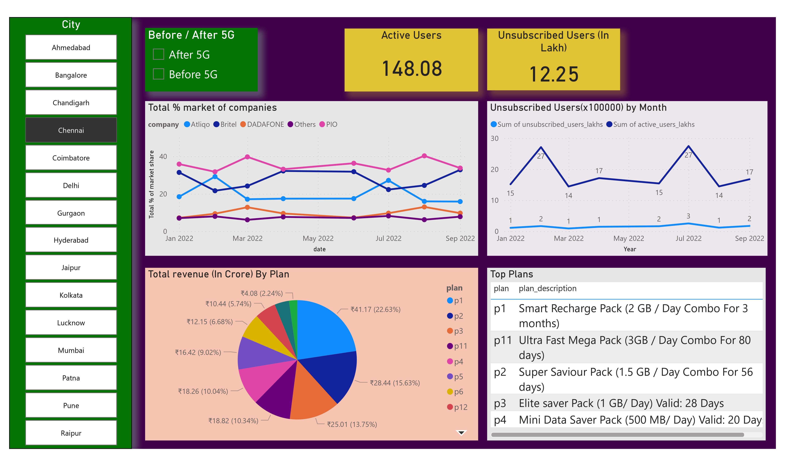

# Telecom Com Challenge
## Analysis of data in telecom domain. 

#### Source - https://codebasics.io/challenge/codebasics-resume-project-challenge

* The data represents the behaviours of before and after delivering the 5G network into the various regions by Atliqo telecom providers. After the 5G network, there will be a difference in the revenue or average revenue per user will be observed. 

